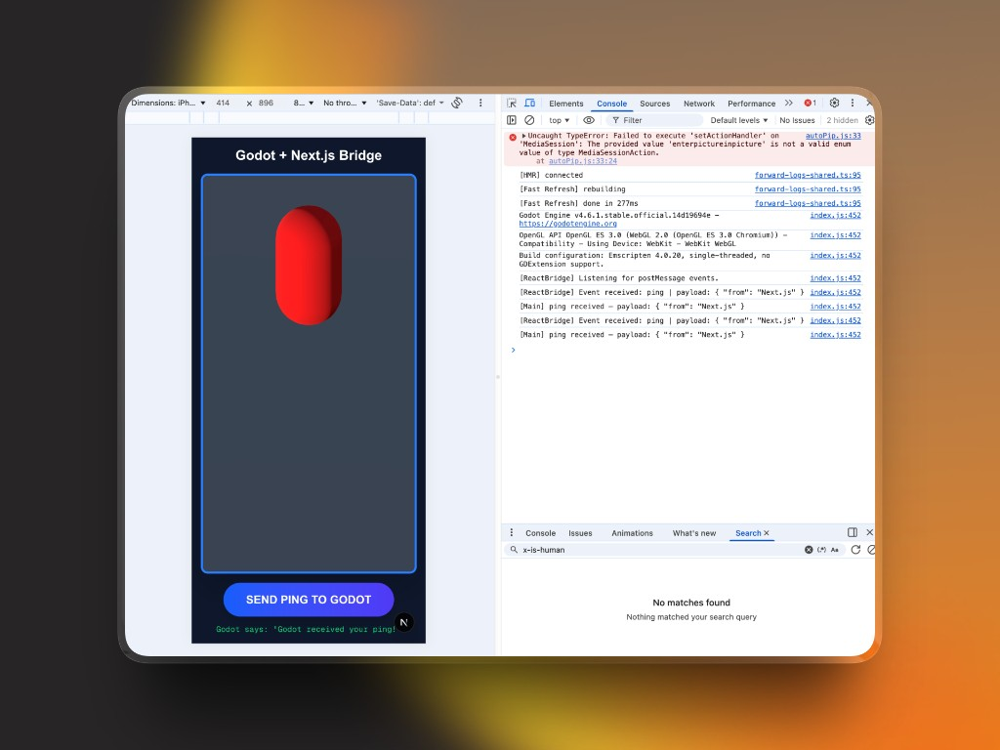

# react-godot-bridge

[](https://www.npmjs.com/package/react-godot-bridge)
[](https://www.npmjs.com/package/react-godot-bridge)
[](https://github.com/MakerDZ/react-godot-bridge/blob/main/LICENSE)
[](https://github.com/MakerDZ/react-godot-bridge)

Bidirectional, event-driven bridge between a **React / Next.js** app and a **Godot 4 WebAssembly** game running inside an `<iframe>`.

Designed to feel like Socket.io — you just call `emit("event")` and `on("event")`. The library handles the iframe, `postMessage`, and `JavaScriptBridge` complexity underneath.



---

## Repository Structure

```
react-godot-bridge/
  npm/              ← npm package source  (published as "react-godot-bridge")
  godot-plugin/     ← Godot 4 Autoload plugin  (copy into your project)
  example/          ← Next.js demo app
```

---

## React / Next.js — npm package

```bash
npm install react-godot-bridge
```

```tsx
import { GodotBridgeProvider, GodotFrame, useGodot } from 'react-godot-bridge';

// Wrap your layout
<GodotBridgeProvider appKey={process.env.NEXT_PUBLIC_BRIDGE_KEY ?? ''}>
  <GodotFrame src="/game/index.html" className="w-full h-screen" />
  <HUD />
</GodotBridgeProvider>

// Use anywhere inside the Provider
const { emit, on } = useGodot();
emit('jump', { height: 2 });
const unsub = on('player_died', (p) => setScore(p.score as number));
```

See [`npm/README.md`](https://github.com/MakerDZ/react-godot-bridge/blob/main/npm/README.md) for full API docs.

---

## Godot — Plugin

Copy `godot-plugin/addons/react_bridge/` into your Godot project, then add the autoload in **Project Settings**:

```ini
[autoload]
ReactBridge="*res://addons/react_bridge/ReactBridge.gd"
```

```gdscript
# Receive from React
func _ready():
    ReactBridge.on_react_event.connect(_on_event)

func _on_event(event: String, data: Dictionary):
    if event == "jump":
        $Player.position.y += data.get("height", 1.0)

# Send to React
ReactBridge.emit_to_react("player_died", { "score": 1500 })
```

See [`godot-plugin/README.md`](https://github.com/MakerDZ/react-godot-bridge/blob/main/godot-plugin/README.md) for full docs.

---

## How It Works

```
React                              Godot (iframe)
──────                             ──────────────
emit("jump", { height: 2 })
  → postMessage(envelope)    →     ReactBridge._on_message()
                                     on_react_event.emit("jump", data)
                                       $Player.position.y += data.height
                                     ReactBridge.emit_to_react("pong", {...})
  on("pong", cb) ←           ←       window.parent.postMessage(envelope)
```

All messages use a standard JSON envelope:

```json
{
  "event": "jump",
  "payload": { "height": 2 },
  "metadata": { "secret": "APP_KEY", "timestamp": 1711910000 }
}
```

---

## Links

- **npm** — [npmjs.com/package/react-godot-bridge](https://www.npmjs.com/package/react-godot-bridge)
- **GitHub** — [github.com/MakerDZ/react-godot-bridge](https://github.com/MakerDZ/react-godot-bridge)

---

## Publishing

```bash
cd npm
bun install
bun run build     # outputs to dist/
npm publish
```
